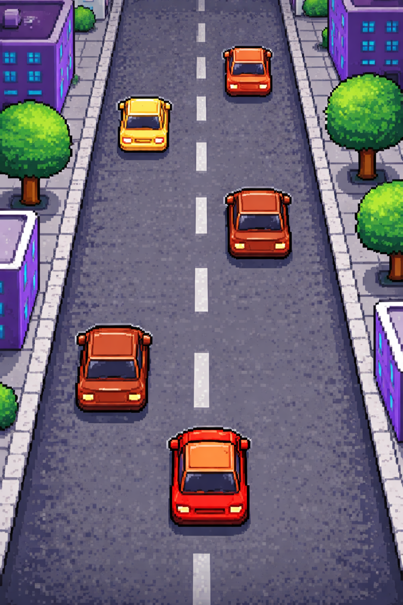

# 2Driving1

Typ gry: endless driving 
Widok: 2D z tyłu
Cel: jechać jak najdłużej bez kolizji

Program: Godot Engine
Język GodotScript

Nazwa gry: Endless Driving

Podstawy:

- Sterowanie:
lewo / prawo – zmiana pasa,
opcjonalnie: przyspieszanie / hamowanie

- Mechanika:
droga przesuwa się w dół (gracz “jedzie do przodu”),
samochód gracza stoi mniej więcej w miejscu (kamera podąża),
inne auta (traffic) jadą w dół lub wolniej niż gracz,
kolizja = koniec gry

Do zrobienia

- Droga (infinite scrolling)
2–3 segmenty drogi zapętlone
gdy jeden znika – przenosi się na górę
przesuwasz teksturę albo całe sprite’y w dół
- Traffic (inne auta)
spawn co X sekund
- różne prędkości
- różne pasy

Grafika i klimat

Tło:
drzewa
budynki

Styl:
pixel art 

Efekty:
dym z opon
światła
screen shake przy kolizji

Dźwięk:
dźwięk silnika (ciągły)
crash
whoosh przy mijaniu auta

